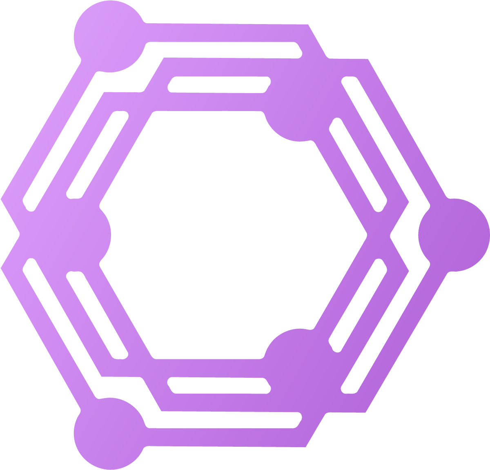

<p align="center">
  <a href="https://dose.wiki"></a>
</p>

<h1 align="center">dose.wiki</h1>

<p align="center"><em>An open encyclopedic database for the study of psychopharmacology</em><br><sub>v0.9 beta</sub></p>

Next.js application for the dose.wiki harm-reduction knowledge base and its Effect Index publication, backed by PlanetScale Postgres since 2026-09-10. Authored handlers in `server/` execute in-process through `lib/postgres/runtime/`. The two publications use one repository, branch, and production database; build-time flavor selects publication identity and route availability. The protected `/dev` surface provides the editorial tools.

---

## Contents
- [Platform Overview](#platform-overview)
- [Data Architecture](#data-architecture)
- [Project Layout](#project-layout)
- [Public Routes](#public-routes)
- [Editor Surface](#editor-surface)
- [Build, Run, and Deploy](#build-run-and-deploy)
- [Development Workflow](#development-workflow)
- [Scripts](#scripts)
- [Further Reading](#further-reading)

---

## Platform Overview

- **Framework**: Next.js 16 App Router, React 19, TypeScript, and Tailwind CSS
- **Runtime data**: the PlanetScale Postgres database, selected by `DATA_BACKEND=postgres`
- **Authentication**: Auth.js (`next-auth`) with database-backed membership roles
- **Package manager**: Bun 1.3.5 with `bun.lock`; package scripts remain available through `npm run`
- **Public rendering**: static generation or ISR where declared
- **Editorial rendering**: protected, request-rendered `/dev` routes with a per-request CSP nonce

The default build is dose.wiki. `NEXT_PUBLIC_SITE_FLAVOR=effectindex` builds Effect Index. The flavor contract lives in `src/config/siteFlavor.ts`.

## Data Architecture

PlanetScale Postgres is the source of truth for public runtime data and the active editor; persisted table names, document IDs, and document shapes remain stable. Representative table groups include:

- articles and editorial content: `substanceIndex`, `subjectiveEffects`, `tripReports`, `effectIndexArticles`;
- media and chemistry: `replications`, `moleculeOverrides`, `moleculeClassTemplates`;
- publishing and provenance: `citationEvidence`, `generatedPublicationOperations`, `changelog`;
- access and site configuration: `memberships`, `contributorProfiles`, `siteConfig`, `indexLayouts`.

Use `server/schema.ts` for the current table inventory and indexes. Use the matching module under `server/` for each query and mutation contract.

Local JSON and Markdown remain useful for migration, backup, export, prompt, and generation workflows. They are not public runtime truth unless active code explicitly reads them. Before changing generated data, consult `data/lineage.json`.

Article shape ownership is split deliberately:

- canonical article schema: `src/schema/substance.schema.ts`;
- shared adapter: `src/schema/substance/contract.ts`;
- generated helpers: `src/data/schema/`;
- stored document shape: `server/schema.ts`.

Article ingestion runs through the shared article adapter so invalid article shapes fail before storage.

## Project Layout

| Path | Responsibility |
|------|----------------|
| `src/app/` | App Router pages, metadata surfaces, and route handlers |
| `src/features/` | Article, editor, effects, replication, and report features |
| `src/components/` | Shared page chrome and UI primitives |
| `lib/` | Server-side auth, data, HTTP, runtime, and Next.js adapters |
| `server/` | Runtime schema, queries, mutations, and actions |
| `scripts/` | Operator workflows for analysis, generation, migration, deployment, and sync |
| `src/data/` | Content loaders, static config, and generated schema helpers |
| `content/` | Authored prose and prompts loaded by code, indexed in [content/README.md](content/README.md) |
| `data/` | Tracked datasets, third-party inputs, and the generated-data lineage manifest |
| `docs/` | Contributor documentation, indexed in [docs/README.md](docs/README.md) |

See [project layout](docs/architecture/project-layout.md) for ownership details and local artifact policy. Use `npm run hygiene:check` to inspect removable ignored/generated artifacts; `npm run hygiene:clean` removes only artifacts approved by that policy.

## Public Routes

Public pages live under `src/app/`. Representative route groups are:

- library and articles: `/substances`, `/[slug]`, `/articles`, and `/articles/[slug]`;
- effects and reports: `/effects`, `/effects/[effectSlug]`, `/reports`, and `/reports/[slug]`;
- media: `/replications` and `/replications/[slug]`;
- discovery: `/category/[categoryKey]`, `/chemical-classes/[classKey]`, `/mechanism/[mechanismSlug]`, `/psychoactive/[...summaryPath]`, and `/search`;
- project pages: `/about`, `/contributors/[profileKey]`, `/docs/how`, `/docs/code`, and `/docs/license`.

Some pages are publication-specific. `src/config/siteFlavor.ts` defines the flavor contract, and `lib/next/flavorGatedRoutes.ts` enforces it. Treat `src/app/**/page.tsx` as the current route map; compatibility redirects and aliases live in `src/middleware.ts` and `lib/next/publicRouteAliases.ts`.

The routes above are live at <https://dose.wiki/> and <https://www.dose.wiki/>. Pre-launch `/preview` addresses permanently redirect to the matching unprefixed route.

### Public read-only API

The read-only API at <https://dose.wiki/api/v1> (OpenAPI 3.1 at
<https://dose.wiki/api/v1/openapi.json>) exposes substance records, normalized
reagent tests, molecule SVGs, and replication collections. The complete
consumer contract, including the canonical replication embed at
`/embed/replications` and its versioned message protocol, is
[docs/api.md](docs/api.md). Use OpenAPI rather than this README for paths and
response shapes.

DoseWiki content is for harm-reduction education and is not medical advice. Review the [license and reuse terms](https://dose.wiki/docs/license) and preserve source attribution.

## Editor Surface

Sign in at `/sign-in`; the protected editor is mounted at `/dev` with tab and item deep links.

The editor groups related work rather than exposing separate applications:

- article work includes Substances, Review, Citations, Tags, and Index layout;
- intake and moderation include Trip reports, Feedback, and Site feedback;
- media tools include Molecules, Banners, and Replications;
- publication tools include Writing, Blog, Copy, and Contributors;
- Profile and Change log remain primary account and audit destinations.

The current tab registry is `TOOL_TAB_ITEMS` in `src/features/dev/pages/DevModePageChrome.tsx`. Tab rendering lives in `DevModePageView.tsx`, and deep-link normalization lives in `devModePageUtils.ts`; use those files instead of copying a tab inventory into documentation.

### Authentication and writes

- Auth.js configuration: `lib/auth/authOptions.ts`
- Runtime auth policy: `lib/auth/runtimePolicy.ts`
- Route gate: `src/middleware.ts`
- Role source: Postgres `memberships`

Editors and admins can use the full surface. Any authenticated user can edit their own profile. Editor tool handlers live under `src/app/api/dev/`; shared save routes live under `src/app/api/`. The preferred article write path is `save-article`, while contributor profiles use `save-user-profile`.

Named rate-limit policies live in `lib/http/rateLimitPolicy.ts`.

## Build, Run, and Deploy

Install with the repository-pinned Bun version:

```bash
bun install --frozen-lockfile
npm run dev
```

`package.json` pins Bun 1.3.5 and owns the full script catalog. Common commands:

| Command | Purpose |
|---------|---------|
| `npm run dev` | Start local Next.js development |
| `npm run build` | Build the application |
| `npm run test` | Run Vitest |
| `npm run lint` | Lint the application |
| `npm run typecheck` | Type-check without emit |
| `npm run verify:app` | Verify app code |
| `npm run verify:workflow` | Verify scripts and data workflows |
| `npm run generate:schema` | Regenerate article-schema helpers |
| `npm run generate:social-cards` | Refresh public-route availability and pre-render shared social cards from the production database |
| `npm run provenance:check` | Check generated-data lineage |

### Environment and deployment

Keep secrets in `.env.local`, the shell, or the hosting provider. Do not commit credential values.

- `lib/runtime/envContract.ts` owns runtime environment diagnostics.
- [Data credentials](docs/operations/data-credentials.md) owns production targets, credentials, write gates, and recovery.
- [Deployment routing](docs/operations/deployment.md) owns Vercel projects, domains, build separation, and release safety.

Every production deployment sets `DATA_BACKEND=postgres`, `POSTGRES_POOLED_URL`, and `REPLICATION_MEDIA_BASE_URL`. Only `dosewiki-admin` carries the write and intent-token tier. Public DoseWiki and Effect Index remain read-only and carry no admin credential. The application and ordinary operators have no alternate backend.

Production writes require an allowlisted command, explicit Postgres target, reviewed dry run, remote-target gates, and the command's confirmations. Implementing a guard does not authorize production use. Follow [data credentials](docs/operations/data-credentials.md) rather than copying credential values or precedence rules here.

`NEXT_PUBLIC_SITE_FLAVOR` selects the publication at build time: unset uses dose.wiki; `effectindex` uses Effect Index. The launched dose.wiki flavor defaults its canonical URL to `https://dose.wiki`.

`dose.wiki` and `www.dose.wiki` use the public-only `dosewiki-public` build. `dev.dose.wiki` and `dosewiki-admin.vercel.app` use the separate, application-authenticated `dosewiki-admin` editor build and remain closed to crawlers. Public-host `/dev`, `/review`, and sign-in links hand off to `dev.dose.wiki`. Retired `/preview` addresses permanently redirect to ordinary App Paths.

`PUBLIC_CACHE_PUBLISH_SECRET` and `PUBLIC_CACHE_PUBLISH_TARGETS` deliver editorial changes to the separate public projects. The signed receiver derives its own paths and tags, grants cache expiry only, and accepts only allowlisted public targets. The editor's durable outbox owns retry and revision receipts. Current variable placement and recovery steps live in [deployment routing](docs/operations/deployment.md).

Vercel builds use `bun run build:vercel`. Read [deployment routing](docs/operations/deployment.md) before changing build keys, aliases, domains, or flavor settings.

## Development Workflow

1. Install with `bun install --frozen-lockfile`.
2. Read [CONTRIBUTING.md](CONTRIBUTING.md), the [glossary](docs/glossary.md), and the ownership document for the feature you are changing.
3. Treat PlanetScale Postgres as runtime truth; use `src/schema/substance.schema.ts` before changing article shape.
4. Keep public App Router reads server-side unless the interaction requires a client subscription.
5. Run the narrow verification command that covers the change. Use `npm run verify:all` only when both app and workflow surfaces changed.

Public server data helpers live in `lib/data/`; metadata and static-route planning live in `lib/next/`. Local `SubstanceIndex.json` is not a public rendering source.

## Scripts

[scripts/README.md](scripts/README.md) is the maintained workflow catalog; `package.json` is the executable command surface. Representative read-only or dry-run entry points are:

```bash
npm run parse:sources
npm run batch:legality -- --dry-run
npm run citations:formal -- --slug=2c-b --dry-run
npm run postgres:check-env-isolation
```

Batch generation uses OpenRouter and requires `OPENROUTER_API_KEY`. Scry access uses `SCRY_API_KEY`. Keep both in `.env.local` or the shell.

Data-changing commands run with `DATA_BACKEND=postgres`, an explicit `TARGET_POSTGRES_URL`, `POSTGRES_IMPORT_CONFIRM` plus `--allow-remote`, `--expected-deployment=<region>.pg.psdb.cloud/postgres` where supported, and the command's write confirmation. Read [Data credentials](docs/operations/data-credentials.md) before running them.

For citation workbench promotion, use `npm run citations:apply-workbench` rather than editing article JSON. Follow the [citation workflow](docs/workflows/citations.md).

## Further Reading

| Document | Description |
|----------|-------------|
| [CONTRIBUTING.md](CONTRIBUTING.md) | Install, run, verify, and pull request expectations |
| [ARCHITECTURE.md](ARCHITECTURE.md) | Architecture entrypoint and links to runtime appendices |
| [AGENTS.md](AGENTS.md) | Repo-specific guidance for automated contributors |
| [docs/README.md](docs/README.md) | Index of every contributor document |
| [docs/api.md](docs/api.md) | Public API and replication embed contract |
| [docs/glossary.md](docs/glossary.md) | Domain language for citations, legality, review, replications, and hosts |
| [docs/architecture/project-layout.md](docs/architecture/project-layout.md) | Contributor-facing folder map and local artifact hygiene rules |
| [docs/design/ui-kit.md](docs/design/ui-kit.md) | Shared UI catalog, rules, and ownership |
| [docs/design/visual-style-guide.md](docs/design/visual-style-guide.md) | Brand and visual language |
| [scripts/README.md](scripts/README.md) | Script catalog and examples |
| [`/docs/code`](https://dose.wiki/docs/code) | Visual codebase overview on the live site |
| [`/docs/how`](https://dose.wiki/docs/how) | Visual walkthrough of how articles are made |

---

If project workflows, schema ownership, or editor/save paths change, update this file together with `AGENTS.md`, `docs/README.md`, and any affected script docs.
